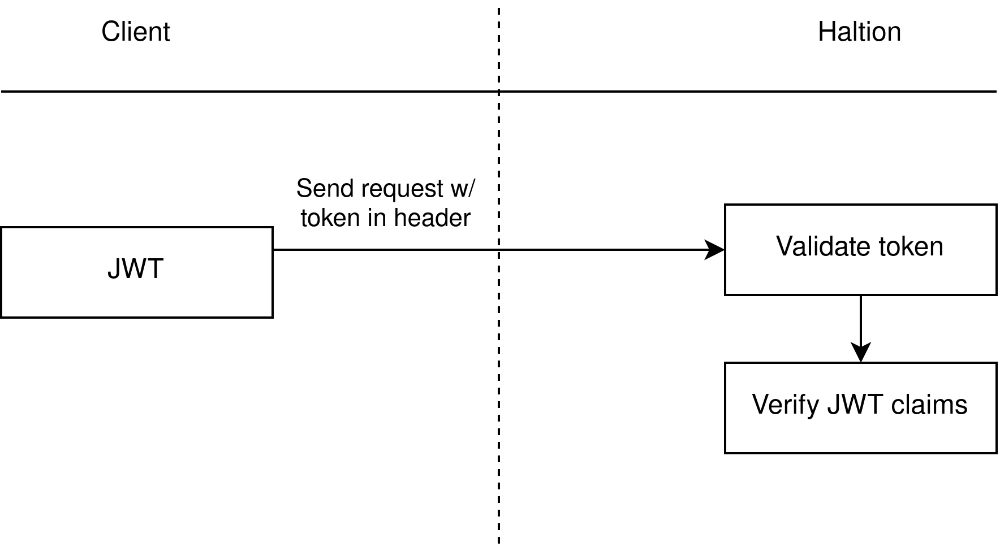

# OTP Implementation

## Overview

The OTP implementation is based on the Time-based One-Time Password (TOTP) algorithm, which is described in [IETF RFC 6238](https://www.rfc-editor.org/rfc/rfc6238). The OTP is generated using the [totp-rs](https://crates.io/crates/totp-rs) crate.

> The diagram only serves as an example. In the real world, you might have a gateway or an edge router in front of Haltion.

### Authentication

Authentication is based on JSON Web Tokens (JWT). The JWT is generated using the [jsonwebtoken](https://crates.io/crates/jsonwebtoken) crate.

When a client sends a request, the server checks the JWT claims. If the JWT is valid, the server approves the request with a 200 OK response. If it's invalid, the server denies access with a 401 Unauthorized response.
