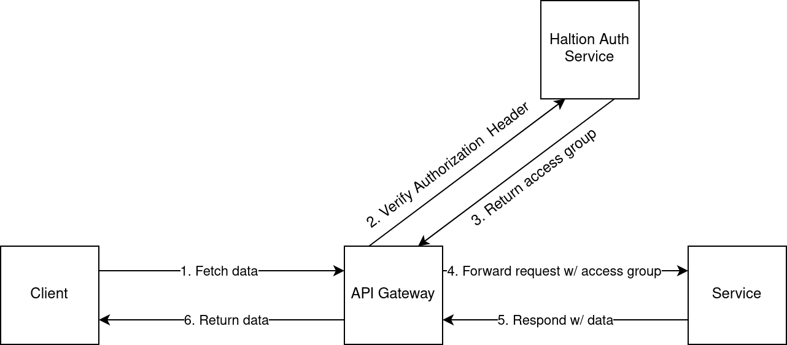
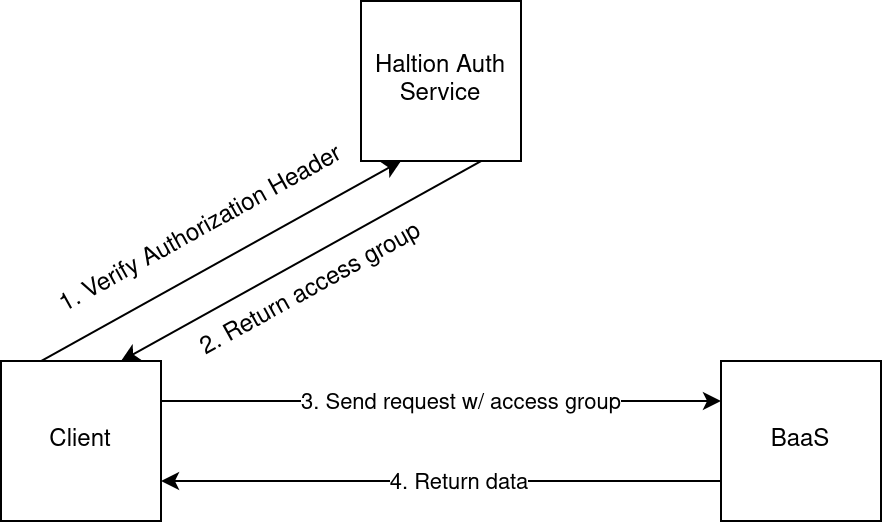

# Authentication & Authorization

Auth is based on JSON Web Tokens (JWT). The JWT is generated using the [jsonwebtoken](https://crates.io/crates/jsonwebtoken) crate.

When a client sends a request, haltion verifies the JWT claims. If the JWT is valid, it responds with some access group. If it's invalid, haltion denies access with a 401 Unauthorized response.

**Integration examples**

1. With an API Gateway

    To access data from a backend, the client sends a request with a JWT added in the header. The request passes through an API gateway. It forwards the authorization header (JWT) to haltion, which checks its validity and provides access groups if authentication is successful. The API gateway then either passes the access groups to a backend service, which verifies access groups and returns the requested data, or returns an error code to the front end.

    The API Gateway acts as a filter layer between external and internal services, processing every incoming request and performing routing and other operations as necessary.

    

2. As a third-party auth service

    In this architecture, the client directly forwards the authentication header or JWT to haltion. In this context, we have a BaaS that stores data and enables scoped access.

    
